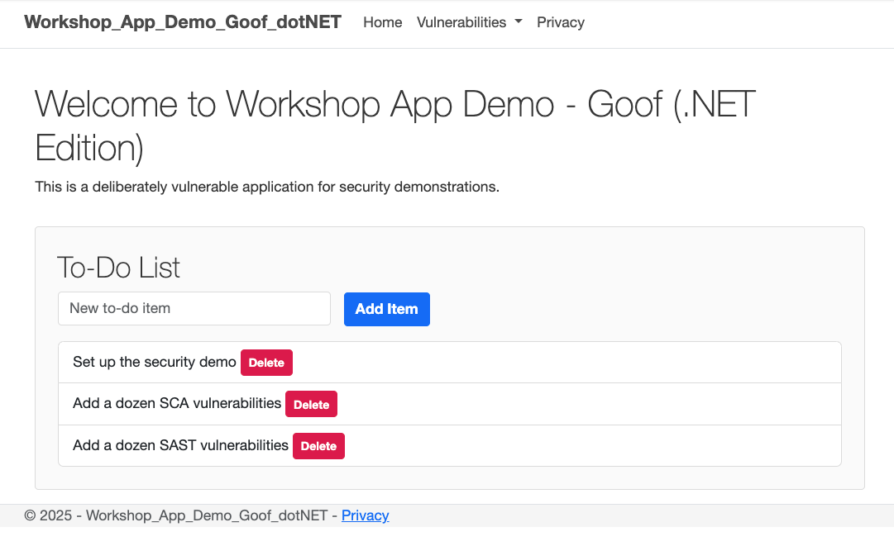

# Workshop App Demo - Goof (.NET Edition)

This is a deliberately vulnerable ASP.NET Core application designed for security demonstrations. It is a C#/.NET port of the original Node.js Goof app and the Java Goof app.

## Features

- **SAST Vulnerabilities**: A dozen common web application vulnerabilities.
- **SCA Vulnerabilities**: Dependencies with known vulnerabilities.
- **Container Vulnerabilities**: A `Dockerfile` using a known vulnerable base image.
- **IaC Misconfigurations**: Terraform files with common security flaws.

## Screenshot



## Getting Started

### Prerequisites

- [.NET SDK](https://dotnet.microsoft.com/download)

### Installation & Running the App

1.  **Clone the repository:**
    ```bash
    git clone https://github.com/JennySnyk/Workshop-App-Demo-Goof-dotNET.git
    ```
2.  **Navigate to the project directory:**
    ```bash
    cd Workshop-App-Demo-Goof-dotNET
    ```
3.  **Run the application:**
    ```bash
    dotnet run
    ```

The application will be available at `http://localhost:5083`.

## Vulnerability Details

Here are the vulnerabilities included in this application. You can access them by navigating to the following paths:

- [Broken Access Control](./Pages/Admin) - *Admin page accessible without login.*
- [Command Injection](./Pages/Vulnerabilities/CmdInjection)
- [Cross-Site Scripting (XSS)](./Pages/Vulnerabilities/Xss)
- [Hardcoded API Key](./Pages/Vulnerabilities/ApiKey)
- [Hardcoded Secrets](./Pages/Vulnerabilities/HardcodedSecrets)
- [Insecure Crypto](./Pages/Vulnerabilities/InsecureCrypto)
- [Insecure Deserialization](./Pages/Vulnerabilities/InsecureDeserialization)
- [Insecure Randomness](./Pages/Vulnerabilities/InsecureRandom)
- [LDAP Injection](./Pages/Vulnerabilities/LdapInjection)
- [Log Forging](./Pages/Vulnerabilities/LogForging)
- [Path Traversal](./Pages/Vulnerabilities/PathTraversal)
- [SQL Injection](./Pages/Vulnerabilities/Sqli)
- [SSRF (Server-Side Request Forgery)](./Pages/Vulnerabilities/Ssrf)
- [SSTI (Server-Side Template Injection)](./Pages/Vulnerabilities/Ssti)
- [Unvalidated Redirect](./Pages/Vulnerabilities/UnvalidatedRedirect)
- [XPath Injection](./Pages/Vulnerabilities/XPathInjection)
- [XXE (XML External Entity)](./Pages/Vulnerabilities/Xxe)

## Disclaimer

**This application is for educational and demonstration purposes only. Do not deploy it in a production environment.**
